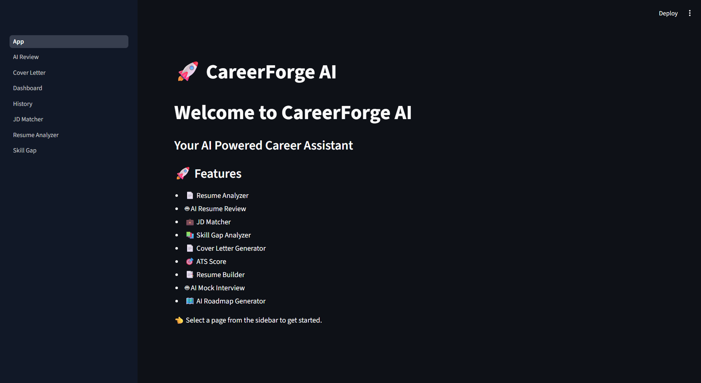
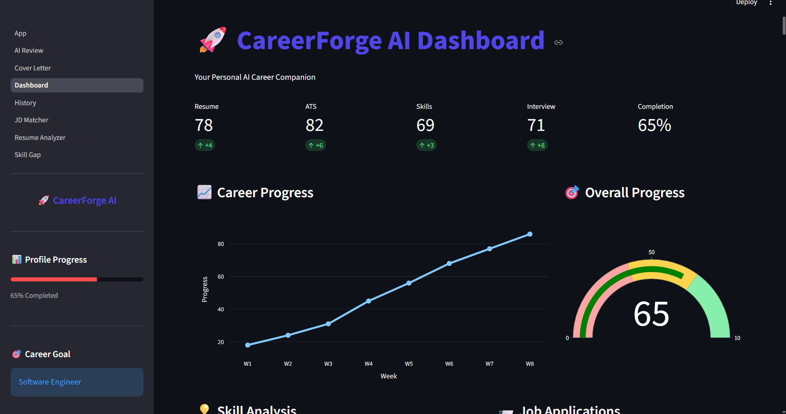
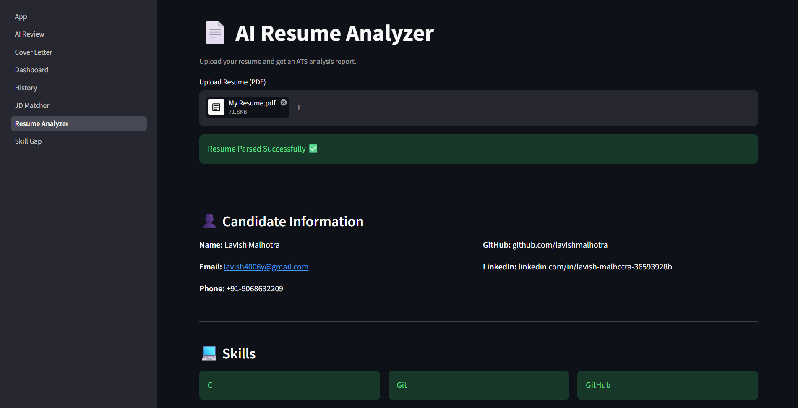
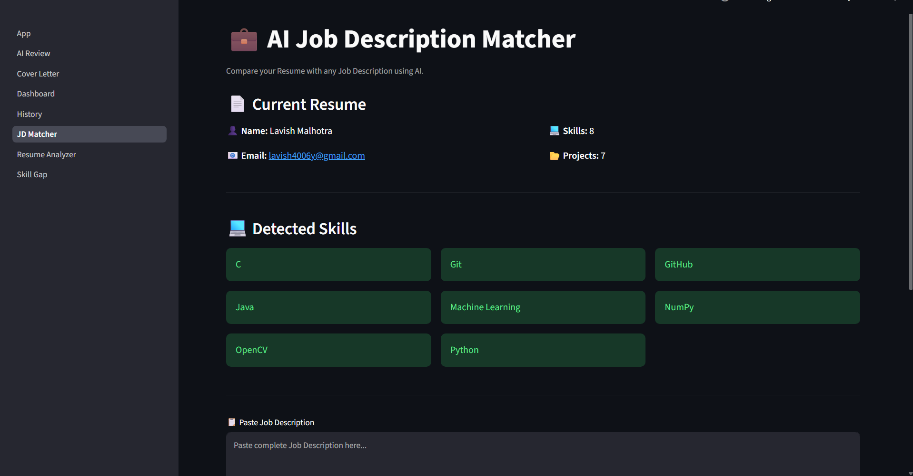
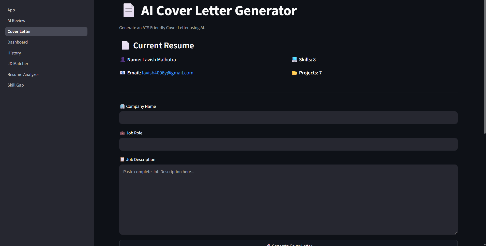

# 🚀 CareerForge AI

<div align="center">

### Your AI-Powered Career Companion

Analyze resumes • Match Job Descriptions • Generate Cover Letters • Identify Skill Gaps • AI Resume Review


</div>

---

# 📖 Overview

CareerForge AI is an intelligent career assistance platform built using **Python**, **Streamlit**, and **Generative AI**. It helps students and job seekers improve their resumes, compare them with job descriptions, generate professional cover letters, identify missing skills, and receive AI-powered career guidance—all from a single dashboard.

Whether you're preparing for campus placements, internships, or full-time jobs, CareerForge AI streamlines the entire application process.

---

# ✨ Key Features

## 📊 AI Resume Analyzer

- ATS Score Analysis
- Resume Quality Evaluation
- Missing Sections Detection
- Keyword Suggestions
- Improvement Recommendations

---

## 🎯 Job Description Matcher

- Compare Resume with JD
- Match Percentage
- Missing Skills Detection
- Keyword Gap Analysis
- Personalized Suggestions

---

## 📝 AI Cover Letter Generator

- Professional Cover Letter
- Company Specific
- Role Specific
- Editable Output
- Copy & Download Support

---

## 🤖 AI Resume Review

- Grammar Suggestions
- Formatting Feedback
- Technical Skill Review
- Resume Improvement Tips

---

## 📈 Skill Gap Analysis

- Identify Missing Skills
- Technical Skill Recommendations
- Soft Skill Suggestions
- Learning Roadmap

---

## 📂 Dashboard

- User Overview
- Resume Statistics
- Activity Tracking
- Career Insights

---

## 🗄️ History

- Save Previous Analyses
- Resume History
- Generated Cover Letters

---

# 🛠 Tech Stack

| Category | Technologies |
|-----------|--------------|
| Language | Python |
| Framework | Streamlit |
| AI | OpenAI / Gemini API |
| Database | SQLite |
| Data Processing | Pandas |
| PDF Handling | PyPDF2 |
| Visualization | Plotly |
| Environment | Python Virtual Environment |

---

# 📁 Project Structure

```
CareerForge-AI/
│
├── ai/
├── assets/
├── database/
├── models/
├── pages/
├── utils/
├── uploads/
├── generated/
├── app.py
├── requirements.txt
└── README.md
```

---

# ⚙️ Installation

### Clone Repository

```bash
git clone https://github.com/lavishmalhotra/CareerForge-AI.git
```

Move into Project Folder

```bash
cd CareerForge-AI
```

Create Virtual Environment

```bash
python -m venv venv
```

Activate Environment

### Windows

```bash
venv\Scripts\activate
```

### Linux / macOS

```bash
source venv/bin/activate
```

Install Dependencies

```bash
pip install -r requirements.txt
```

Create a `.env` file and add your API keys.

Run Application

```bash
streamlit run app.py
```

---

## 🏠 Home Page



## 📊 Dashboard



## 📄 Resume Analyzer



## 🎯 JD Matcher



## 📝 Cover Letter Generator



---

# 🚀 Future Enhancements

- AI Mock Interview
- Voice Interview Assistant
- Resume Version Comparison
- Live Job Recommendation
- Resume Builder
- LinkedIn Profile Analyzer
- Portfolio Analyzer
- AI Career Coach

---

# 🎯 Target Users

- Students
- Freshers
- Job Seekers
- Working Professionals
- Career Coaches

---

# 🤝 Contributing

Contributions are always welcome.

1. Fork the repository

2. Create a new branch

3. Commit your changes

4. Push the branch

5. Open a Pull Request

---

# 📄 License

This project is licensed under the MIT License.

---

# 👨‍💻 Developer

**Lavish Malhotra**

B.Tech CSE (AI & ML)

DIT University

GitHub: https://github.com/lavishmalhotra

---

## ⭐ Support

If you found this project useful, consider giving it a ⭐ on GitHub.
